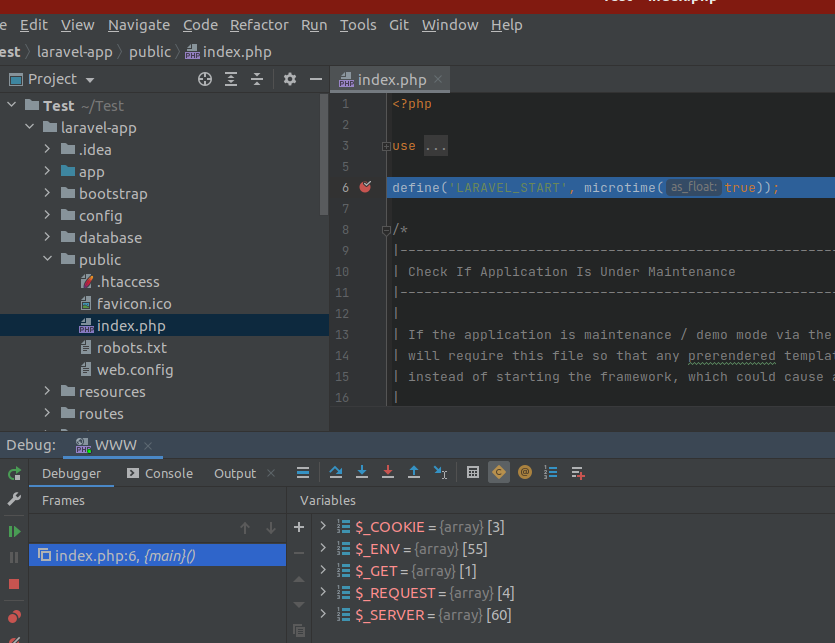
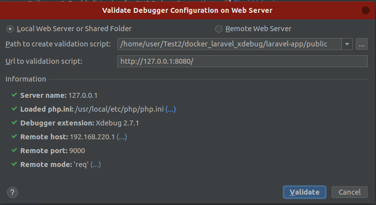

# docker_laravel_xdebug

Проект включает в себя docker-compose с nginx, mariadb, php контейнер с xdebug-2.7.1
Все элементы контейнера смонтированны в свои папки, инсталяция laravel настроенна (проект подключен к бд, в бд тоже создан юзер).
Системные файлы .env, файлы БД в .gitignore не добавлял. Разработчику достаточно клонировать репозиторий, запустить docker-compose up –d.
Проект доступен по адресу http://localhost:8080

